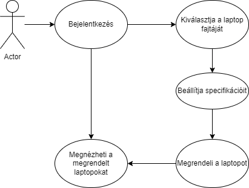
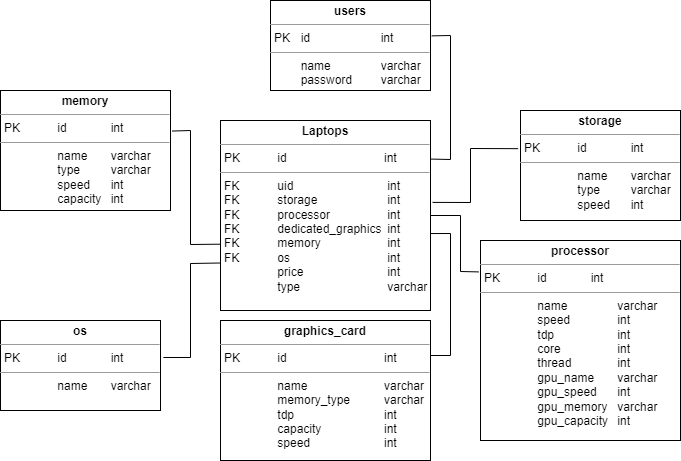

## 1. Rendszer célja
**A rendszer célja egy olyan ablakos alkalmazás, amivel egy online Lenovo laptop bolt tud vásárlók számára laptopokat rendelni.Bejelentkezés/regisztráció után a  lehetősége lesz laptop típusát választani majd azt konfigurálva megrendelni.Megrendelt laptopok adatait meg lehet tekinteni.**

## 2. Üzleti folyamatok modellje

## 3. Követelmények
**Funkcionális követelmények**
- **Felhasználói adatok tárolása**
- **Felhasználó tudjon laptop konfigurációt készíteni és rendelni**
- **Felhasználó tudja a megrendelt laptopokat megtekinteni**

## 4. Funkcionális terv
**Rendszerszereplők:**
- **Felhasználó**
- **Vendég**

**Rendszerhasználati esetek és lefutásaik:**
- **Felhasználó**
  - **Konfigurálhat és megrendelhet laptopot**
  - **Megnézheti a megrendelt laptopokat**

- **Vendég**
  - **Tud regisztrálni és bejelentkezni**

  - **Bejelentkezés után:**
    - **Laptopok létrehozása és megrendelése**
    - **Megrendelt laptopok megtekintése**
  
## 5. Fizikai környezet
- **Intellij**
- **Xampp/Mysql**
- **JavaFx**

## 6. Architekturális terv
 - **Adatbázisszerver(Mysql)**
 - **Java**
 - **JavaFx**
 
## 7. Implementációs terv
**Az alkalmazás Java nyelven készül. Az ablakok megjelenítését, módosítását JavaFx-segítségévle kezeljük. A fejlesztés során két tervezési mintát fogunk megvalósítani. Az első a Decorator amivel a kuponos akciókat fogjuk kezelni. A második pedig a Controller melynek segíségével fogjuk a konfigurációkat összerakni.**
 
## 8. Adatbázisterv

## 9. Tesztterv

## 10. Telepítési terv
